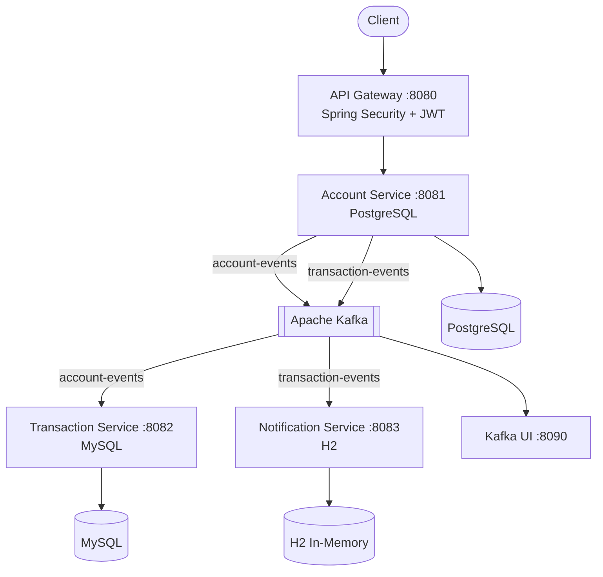

# 🏦 BankFlow — Banking Microservices Platform

A production-grade banking microservices system built with Spring Boot, Apache Kafka, PostgreSQL, and Docker.

## 🏗️ Architecture

## ✨ Features

- **REST APIs** — Full CRUD for account management
- **Event-Driven Architecture** — Kafka producers and consumers
- **Security** — Spring Security + JWT authentication
- **Database** — PostgreSQL with HikariCP connection pool
- **Caching** — Redis L2 cache for account data
- **Monitoring** — Spring Actuator health endpoints
- **Containerized** — Full Docker Compose setup
- **Exception Handling** — Global handler with consistent API responses
- **Validation** — Bean validation on all request DTOs

## 🛠️ Tech Stack

| Technology | Version | Purpose |
|---|---|---|
| Java | 21 | Core language |
| Spring Boot | 3.5.13 | Application framework |
| Apache Kafka | 3.9.2 | Event streaming |
| PostgreSQL | 15 | Primary database |
| HikariCP | 6.3.3 | Connection pooling |
| Hibernate | 6.6.45 | ORM |
| Docker | Latest | Containerization |
| Lombok | 1.18.44 | Boilerplate reduction |
| JWT (jjwt) | 0.11.5 | Authentication tokens |

## 📁 Project Structure
account-service/
└── src/main/java/com/bankflow/account/
├── config/          # Kafka, Security configuration
├── controller/      # REST API endpoints
├── service/         # Business logic interfaces
│   └── impl/        # Service implementations
├── repository/      # JPA repositories
├── entity/          # Database entities
├── dto/
│   ├── request/     # Incoming request DTOs
│   └── response/    # Outgoing response DTOs
├── event/           # Kafka event classes
├── exception/       # Custom exceptions + Global handler
├── security/        # JWT utilities
└── util/            # Helper classes

## 🚀 Quick Start

### Prerequisites
- Java 21
- Docker Desktop
- Maven

### Run Infrastructure
```bash
docker-compose up -d
```

This starts:
- PostgreSQL on port 5432
- Apache Kafka on port 9092
- Kafka UI on port 8090
- Zookeeper (internal)

### Run Application
```bash
./mvnw spring-boot:run
```

Application starts on `http://localhost:8081`

## 📡 API Endpoints

### Account Management

| Method | Endpoint | Description |
|---|---|---|
| POST | `/api/v1/accounts` | Create new account |
| GET | `/api/v1/accounts` | Get all accounts |
| GET | `/api/v1/accounts/{id}` | Get account by ID |
| GET | `/api/v1/accounts/number/{no}` | Get by account number |
| GET | `/api/v1/accounts/status/{status}` | Filter by status |
| POST | `/api/v1/accounts/{id}/deposit` | Deposit money |
| POST | `/api/v1/accounts/{id}/withdraw` | Withdraw money |
| PATCH | `/api/v1/accounts/{id}/status` | Update status |
| DELETE | `/api/v1/accounts/{id}` | Close account |

### Health Check
GET http://localhost:8081/actuator/health

## 📨 Sample API Calls

### Create Account
```bash
curl -X POST http://localhost:8081/api/v1/accounts \
  -H "Content-Type: application/json" \
  -d '{
    "accountHolderName": "Shiva Kumar",
    "email": "shiva@bankflow.com",
    "phoneNumber": "9876543210",
    "accountType": "SAVINGS",
    "initialDeposit": 5000
  }'
```

### Response
```json
{
  "success": true,
  "message": "Account created successfully",
  "data": {
    "id": "39cc812e-e476-4296-b279-fc5abe8dbc29",
    "accountNumber": "BF20260000001001",
    "accountHolderName": "Shiva Kumar",
    "email": "shiva@bankflow.com",
    "balance": 5000,
    "accountType": "SAVINGS",
    "status": "ACTIVE"
  },
  "timestamp": "2026-04-20T18:37:28.73"
}
```

### Deposit Money
```bash
curl -X POST http://localhost:8081/api/v1/accounts/{id}/deposit \
  -H "Content-Type: application/json" \
  -d '{
    "amount": 2000,
    "remarks": "Salary credit"
  }'
```

## 🎯 Design Patterns Used

| Pattern | Where Applied |
|---|---|
| Repository Pattern | Data access layer |
| Service Layer Pattern | Business logic separation |
| DTO Pattern | API request/response objects |
| Builder Pattern | Object construction (Lombok) |
| Observer Pattern | Kafka event publishing |
| Factory Pattern | Credit score providers |
| Singleton | Spring Beans |
| Strategy Pattern | CIBIL vs CRIF providers |

## 🔑 Key Design Decisions

### Why Microservices?
Each service scales independently. Transaction service handles 10x more traffic than Account service — scale only what needs scaling.

### Why Kafka over REST for inter-service communication?
Kafka decouples services — if Notification service is down, messages wait in Kafka and are processed when it recovers. REST would fail immediately.

### Why PostgreSQL for Account Service?
Banking requires ACID compliance. PostgreSQL provides strong consistency and supports row-level locking for concurrent transactions.

### Why Optimistic Locking?
Account reads far outnumber writes. Optimistic locking via `@Version` prevents lost updates without holding DB locks — better performance at scale.

## 📊 Kafka Topics

| Topic | Producers | Consumers | Purpose |
|---|---|---|---|
| account-events | Account Service | Transaction, Notification | Account lifecycle events |
| transaction-events | Transaction Service | Notification Service | Transaction records |
| notification-events | Transaction Service | Notification Service | Alert triggers |

## 🔍 Monitoring

```bash
# Health check
curl http://localhost:8081/actuator/health

# Metrics
curl http://localhost:8081/actuator/metrics

# Kafka UI Dashboard
open http://localhost:8090
```

## 🧪 Running Tests
```bash
./mvnw test
```

## 📈 Future Roadmap

- [ ] KYC Service (Aadhaar masking, PAN verification)
- [ ] CIBIL/CRIF credit score integration
- [ ] Loan Generation System
- [ ] Spring AI + RAG pipeline
- [ ] React frontend dashboard
- [ ] Kubernetes deployment manifests
- [ ] GitHub Actions CI/CD pipeline

## 👨‍💻 Author

**Shiva Kumar**
- Built as a demonstration of senior-level Java microservices architecture
- Covers: Spring Boot, Kafka, PostgreSQL, Docker, JWT, Design Patterns, SOLID Principles

## 📝 License
MIT License