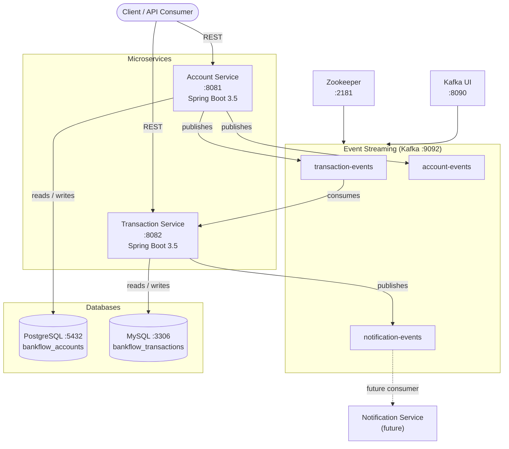
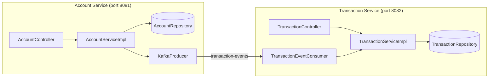
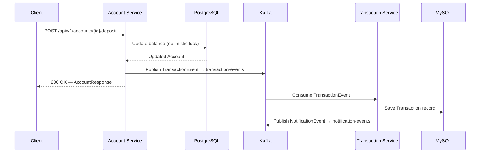
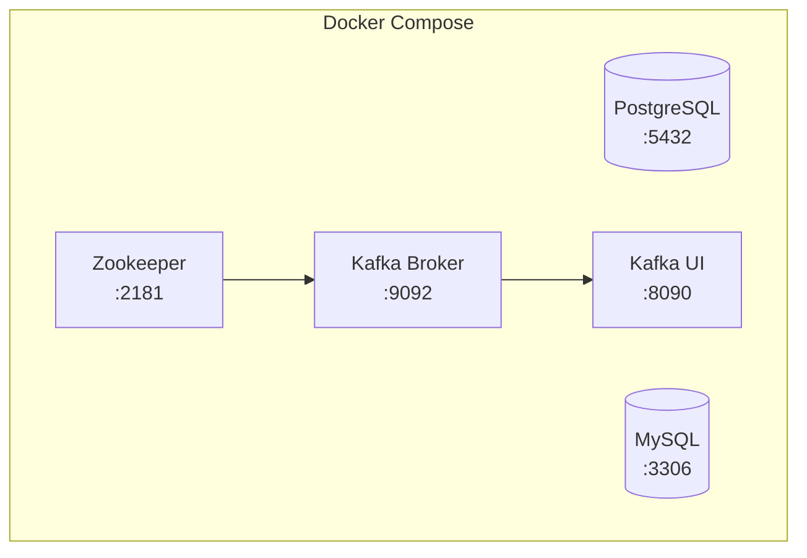

# BankFlow

A microservices-based banking platform built with Spring Boot, Kafka, and PostgreSQL/MySQL.

---

## Architecture Overview



---

## Service Map



---

## Data Flow: Deposit / Withdrawal



---

## Modules

### Account Service

| Layer | Key Classes |
|---|---|
| Controller | `AccountController` |
| Service | `AccountServiceImpl` |
| Entity | `Account` (`AccountType`, `AccountStatus`) |
| Events | `TransactionEvent`, `AccountCreatedEvent` |
| Security | JWT configured, disabled in dev |

**REST Endpoints**

| Method | Path | Description |
|---|---|---|
| `POST` | `/api/v1/accounts` | Create account |
| `GET` | `/api/v1/accounts` | List all accounts |
| `GET` | `/api/v1/accounts/{id}` | Get by ID |
| `GET` | `/api/v1/accounts/number/{accountNumber}` | Get by account number |
| `GET` | `/api/v1/accounts/status/{status}` | Filter by status |
| `GET` | `/api/v1/accounts/balance?email=` | Get balance by email |
| `POST` | `/api/v1/accounts/{id}/deposit` | Deposit funds |
| `POST` | `/api/v1/accounts/{id}/withdraw` | Withdraw funds |
| `PATCH` | `/api/v1/accounts/{id}/status` | Update account status |
| `DELETE` | `/api/v1/accounts/{id}` | Close account (soft delete) |

**Database**: PostgreSQL `bankflow_accounts` — table `accounts`  
**Kafka publishes**: `transaction-events`, `account-events`

---

### Transaction Service

| Layer | Key Classes |
|---|---|
| Controller | `TransactionController` |
| Service | `TransactionServiceImpl` |
| Entity | `Transaction` (`TransactionType`, `TransactionStatus`) |
| Consumer | `TransactionEventConsumer` |
| Events | `NotificationEvent` |

**REST Endpoints**

| Method | Path | Description |
|---|---|---|
| `GET` | `/api/v1/transactions` | List all transactions |
| `GET` | `/api/v1/transactions/{id}` | Get by ID |
| `GET` | `/api/v1/transactions/account/{accountId}` | Transactions for account (UUID) |
| `GET` | `/api/v1/transactions/account/number/{accountNumber}` | Transactions by account number |
| `GET` | `/api/v1/transactions/type/{type}` | Filter by type |

**Database**: MySQL `bankflow_transactions` — table `transactions`  
**Kafka consumes**: `transaction-events`  
**Kafka publishes**: `notification-events`

---

## Kafka Topics

| Topic | Producer | Consumer | Purpose |
|---|---|---|---|
| `account-events` | Account Service | — | Account lifecycle events |
| `transaction-events` | Account Service | Transaction Service | Deposit / withdrawal / transfer events |
| `notification-events` | Transaction Service | Future notification service | Post-transaction notifications |

All topics: 3 partitions, replication factor 1.

---

## Infrastructure



Start all infrastructure:

```bash
docker-compose up -d
```

---

## Getting Started

### Prerequisites

- Java 21
- Docker & Docker Compose
- Maven

### Run

```bash
# 1. Start infrastructure
docker-compose up -d

# 2. Start Account Service
cd account-service
./mvnw spring-boot:run

# 3. Start Transaction Service (separate terminal)
cd transaction-service
./mvnw spring-boot:run
```

| Service | URL |
|---|---|
| Account Service | http://localhost:8081 |
| Transaction Service | http://localhost:8082 |
| Kafka UI | http://localhost:8090 |

---

## API Response Format

All endpoints return a consistent envelope:

```json
{
  "success": true,
  "message": "Operation successful",
  "data": {},
  "timestamp": "2024-12-19T10:30:45.123456"
}
```

---

## Key Design Decisions

| Pattern | Where |
|---|---|
| Event-driven (Kafka pub/sub) | Inter-service communication — no direct HTTP calls between services |
| Optimistic locking (`@Version`) | `Account` entity — prevents concurrent balance corruption |
| Soft delete | Accounts are marked `CLOSED`, never hard-deleted |
| Java Records for DTOs | `AccountResponse`, `TransactionResponse` — immutable by default |
| Separate databases per service | PostgreSQL for accounts, MySQL for transactions — service isolation |